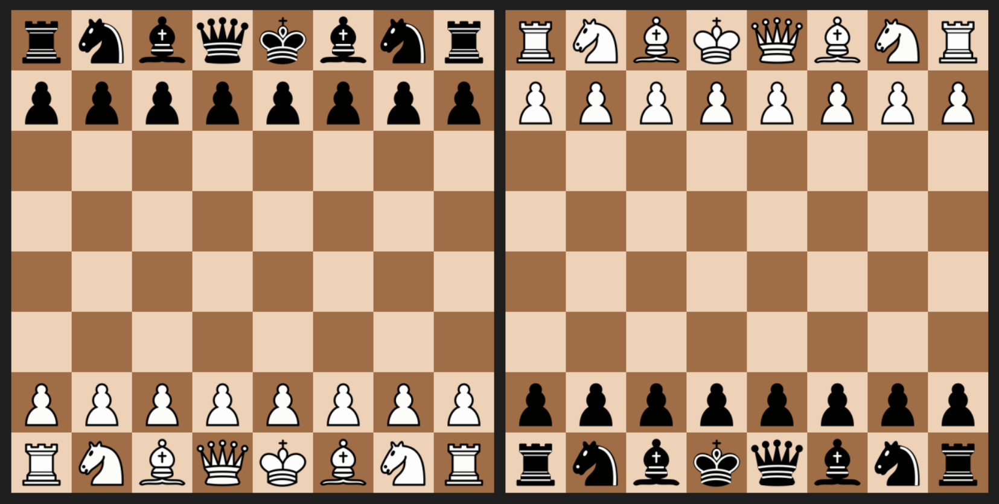

# PyKnight


A customizable chess game I made in Python as a solo hobby project.

The goal of this project was to design & implement a complete chess game without using external chess libraries.

## Preview


## Features

### Pygame UI
- Two boards for both perspectives
- Interactive controls
- Multiple piece sets
- Multiple board palettes

### Engine
- Legal move validation for all pieces
- Check, checkmate, stalemate
- Pawn promotion
- Castling
- En passant
- Undoing moves
- Save & load functionality

## Setup
Clone the repository:
``` bash
git clone https://github.com/Leshiro/py-knight.git
``` 
Navigate into the installed folder:
``` bash
cd py-knight
```
Install dependencies:
``` bash
pip install -r requirements.txt
```
Run the game:
``` bash
python main.py
```
After setup, you can run the game by navigating to the installed folder in file explorer and running `main.py`.

Alternatively, you can run the game without a terminal by running `main.pyw` (only on Windows).

## Contributions
Contributions, reporting issues and feature requests are welcome. Feel free to submit an issue or open a pull request.

## Possible improvements
- Remove global state variables & switch to `State` class object
- Split save/load functions to separate file
- Piece points indicator
- Better window scaling, window resizing, top panel, minimize option
- Bot match
- Online matchmaking
- User accounts, elo system etc.

## Credits
This project would not be possible without the following resources:
- Lichess's open source piece images: https://github.com/lichess-org/lila/tree/master/public/piece
- Pinetools's great SVG to PNG converter: https://pinetools.com/bulk-batch-svg-converter-viewer


## Built With
- Python: https://www.python.org/
- Pygame-ce: https://github.com/pygame-community/pygame-ce
